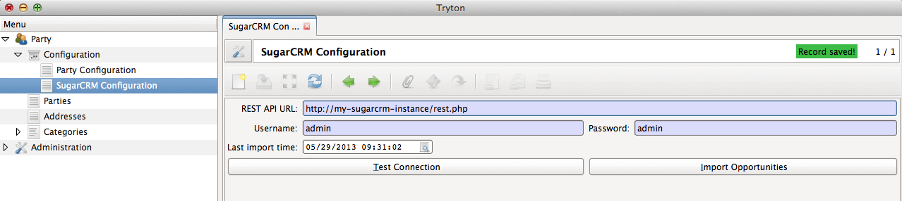

Configuring SugarCRM authentication details
===========================================

The module should be configured with the REST API URL of the SugarCRM
instance. The username and password of a user with sufficient access
privileges is also required. This user can simply be the admin user.

.. _configure-sugarcrm-account:

Configure SugarCRM account
--------------------------

| ``Menu: Party > Configuration > SugarCRM Configuration``

