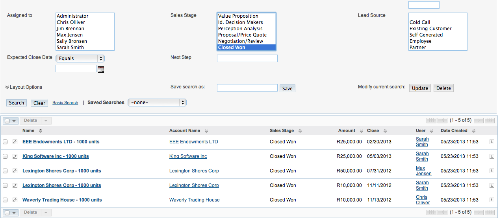
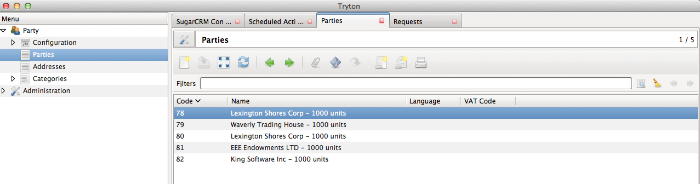
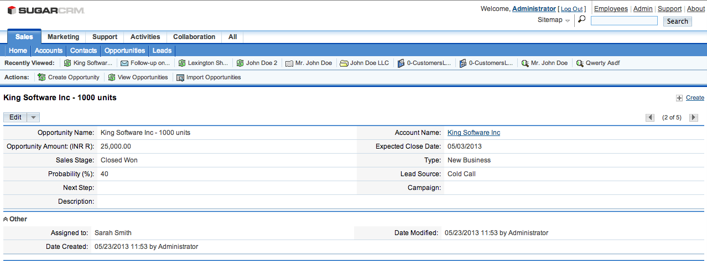

Import Opportunities from SugarCRM
==================================

This section explains how the import of opportunities from SugarCRM will
represent itself on Tryton.

.. note:: All the data represented below is demo data and is only for 
  demonstration purposes.

.. _import-opportunities:

Opportunities are imported as Parties
-------------------------------------

Only opportunities in the `Closed Won` state are imported in Tryton. This is
periodically done by the Tryton CRON system. The default interval between two
imports is a day, but can be modified to your requirements.
:ref:`sugarcrm-cron`.

**Opportunities in SugarCRM**

**Opportunities imported as Parties in Tryton**

| ``Menu: Party > Parties``

**Opportunity View in SugarCRM**

**Party in Tryton**

.. image:: images/party.png
   :width: 900

Understanding the import mappings
---------------------------------

* **Opportunities in `Closed Won` state** are imported as **Parties**

* **Accounts related to Opportunity** are imported as **addresses**.

* **Billing and Shipping addresses on each account** are imported as
  **addresses**.

* **Contacts related to the Opportunity** are also imported as **addresses**.

* **Any phone, fax, email or website linked to Account or Contact** are
  imported as **contact mechanisms**.

* **Any documents attached to Opportunity, Account or Contact** are
  imported as **attachments**. It can be accessed as shown in section
  :ref:`accessing-attachments` 
